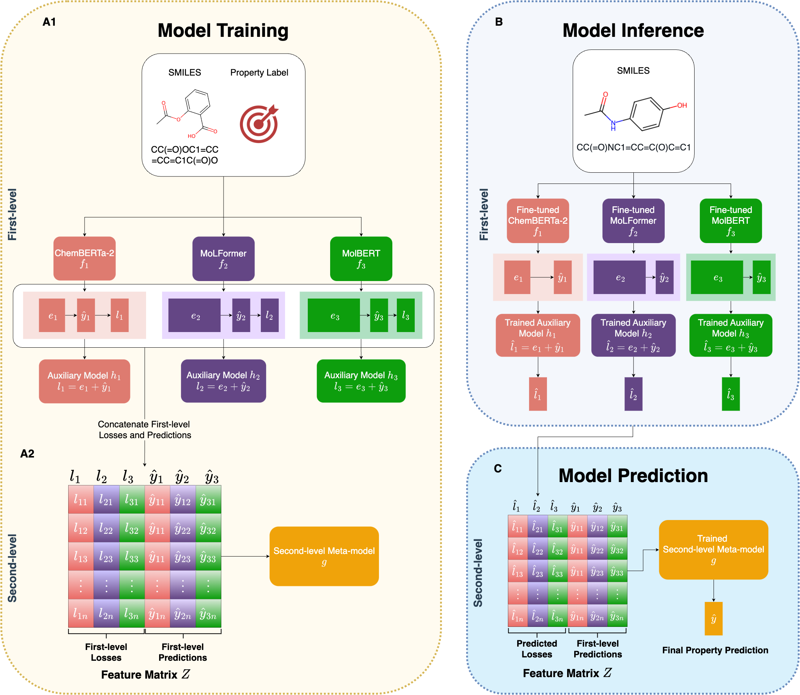

# FusionCLM: Enhanced Molecular Property Prediction via Knowledge Fusion of Chemical Language Models



## Repository Structure
This repository contains the implementation of the FusionCLM project, organized as follows:

- `datasets/`: This folder contains the datasets used for training and evaluation.
- `first-level/`: This folder contains three subfolders, each corresponding to a different CLM:
  - `ChemBERTa-2/`: [ChemBERTa-2 Manuscript](https://github.com/chemberta/chemberta-2)
  - `MoLFormer/`: [MolFormer Repository](https://github.com/IBM/molformer)
  - `MolBERT/`: [MolBERT Repository](https://github.com/BenevolentAI/MolBERT)
- `second-level/`: This folder contains the code for various meta-model options used in the second level of the FusionCLM framework.

## Usage
To use this repository, follow the steps below:

1. Clone this repository:
    ```sh
    git clone https://github.com/yourusername/FusionCLM.git
    ```
2. Navigate to the repository directory:
    ```sh
    cd FusionCLM
    ```
    
### First-Level Models
For the usage of first-level models, please refer to the original repositories or manuscripts of those models.

We have provided example codes to execute the feature extraction, hyperparameter tuning, and fine-tuning of these models. Note that ChemBERTa2 and MolFormer can operate under the same environment, but MolBERT requires a different environment. The environment requirements are included in the respective subfolders under `first-level/`.

### Second-Level Models
For second-level models, we provided all results from the first level to build the feature matrix. Additionally, we included all codes for primary and ablation studies in the `second-level/` directory.

To train the second-level meta-models, use the scripts provided in the `second-level/` directory.

## Results
Our experiments show that the FusionLCLM algorithm outperforms individual LCLMs and baseline graph neural network models in predicting molecular properties. Detailed results and analyses are provided in the accompanying paper.

## Contact
For any questions or inquiries, please contact [lorraine.lu@mail.utoronto.ca](mailto:lorraine.lu@mail.utoronto.ca).
